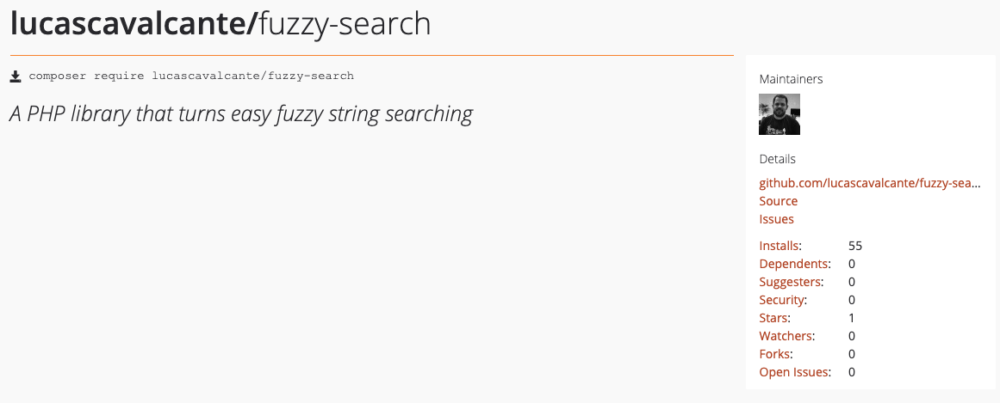

# Fuzzy Search

A PHP library that turns easy fuzzy string searching



## Installation

`composer require lucascavalcante/fuzzy-search`

## Use

Given an array

```php
$series = [
    ['title' => 'Grey\'s Anatomy', 'releaseYear' => '2016'],
    ['title' => 'Prison Break', 'releaseYear' => '2008'],
    ['title' => 'How I Met Your Mother', 'releaseYear' => '2014'],
    ['title' => 'Supernatural', 'releaseYear' => '2016'],
    ['title' => 'Breaking Bad', 'releaseYear' => '2013'],
    ['title' => 'The Vampire Diaries', 'releaseYear' => '2017'],
    ['title' => 'The Walking Dead', 'releaseYear' => '2015'],
    ['title' => 'Pretty Little Liars', 'releaseYear' => '2016'],
    ['title' => 'Once Upon a Time', 'releaseYear' => '2016'],
    ['title' => 'Sherlock', 'releaseYear' => '2016'],
    ['title' => 'Death Note', 'releaseYear' => '2006'],
    ['title' => 'Lottie Dottie Chicken', 'releaseYear' => '2009'],
    ['title' => 'Black Mirror', 'releaseYear' => '2016'],
    ['title' => 'The 100', 'releaseYear' => '2016'],
    ['title' => 'Marvel\'s Luke Cage', 'releaseYear' => '2016'],
    ['title' => 'Marvel\'s Iron Fist', 'releaseYear' => '2017'],
    ['title' => 'Narcos', 'releaseYear' => '2016'],
    ['title' => '3%', 'releaseYear' => '2016'],
    ['title' => 'Sex, Love and Therapy', 'releaseYear' => '2014'],
    ['title' => 'White Girl', 'releaseYear' => '2016'],
    ['title' => 'Girlboss', 'releaseYear' => '2017'],
    ['title' => 'City of God: 10 Years Later', 'releaseYear' => '2013'],
    ['title' => '13 Reasons Why', 'releaseYear' => '2017'],
    ['title' => '90210', 'releaseYear' => '2013'],
    ['title' => 'Gossip Girl', 'releaseYear' => '2012'],
    ['title' => 'Bates Motel', 'releaseYear' => '2016'],
    ['title' => '30 Rock', 'releaseYear' => '2012'],
];
```

Create a new object

```php
use FuzzySearch\FuzzySearch;

$keyToBeSearched = 'title'
$fuzzy = new FuzzySearch($series, $keyToBeSearched);
```

Doing the search

```php
$term = 'the hundred';
$maxDistance = 4;
print_r($fuzzy->search($term, $maxDistance));
```

Result

```
Array
(
    [0] => Array
        (
            [title] => The 100
            [releaseYear] => 2016
            [distance] => 0
        )

)
```

## License

This project is licensed under the MIT license.
